From versjon -6:

| Category         | Attribute                | Description (Norwegian only)                                                                          | Resource                                                                | Profile                                                                                                        |
|:-----------------|:-------------------------|:------------------------------------------------------------------------------------------------------|:------------------------------------------------------------------------|:---------------------------------------------------------------------------------------------------------------|
|                   |"toa"                    | Tidspunkt (unixtid/epoch time) da attestering ble utført.  | [AuditEvent](https://hl7.org/fhir/R4/auditevent) | This profile
| practitioner     | "identifier"             | Helsepersonellets fødselsnummer og navn fra folkeregisteret                                           | [Practitioner](https://hl7.org/fhir/R4/practitioner.html)               | [auditevent-practitioner](StructureDefinition-auditevent-practitioner.html)                          |
| practitioner     | "hpr-nr"                 | Helsepersonellets HPR-nummer, dersom det finnes                                                       | [Practitioner](https://hl7.org/fhir/R4/practitioner.html)               | [auditevent-practitioner](StructureDefinition-auditevent-practitioner.html)                          |
| practitioner     | "authorization"     	  | Helsepersonellets autorisasjon, dersom den finnes                                                     | [Practitioner](https://hl7.org/fhir/R4/practitioner.html)               | [auditevent-practitioner](StructureDefinition-auditevent-practitioner.html)                           |
| practitioner     | "legal-entity"           | Hovedenheten (den juridisk ansvarlige virksomheten) hvor helsepersonellet jobber sitt org.nr og navn. | [Organization](https://hl7.org/fhir/R4/organization.html)               | [auditevent-practitioner-legalentity](StructureDefinition-auditevent-practitioner-legalentity.html)   |
| practitioner     | "point-of-care"          | Behandlingsstedets org.nr. og navn. Kan være lik verdi som i "legal-entity"                        | [Organization](https://hl7.org/fhir/R4/organization.html)               | [auditevent-encounter-pointofcare-organization](StructureDefinition-auditevent-practitioner-pointofcare-organization.html)          |
| practitioner     | "department"             | Avdeling/org.enhet hvor helsepersonellet yter helsehjelp                                              | [Organization](https://hl7.org/fhir/R4/organization.html)               | [auditevent-department](StructureDefinition-auditevent-department.html)       |
| care-relation    | "healthcare-service"     | Helsetjenestetyper som leveres ved virksomheten                                                       | [Encounter](https://hl7.org/fhir/R4/encounter.html)                     | [auditevent-encounter](StructureDefinition-auditevent-encounter.html)                                 |
| care-relation    | "purpose-of-use"         | Helsepersonellets formål med helseopplysningene (til hva de skal brukes)                              | [AuditEvent](https://hl7.org/fhir/R4/auditevent.html)                   | This profile                                                                                                    |
| care-relation    | "purpose-of-use-details" | Detaljert beskrivelse av helsepersonellets formål med helseopplysningene (til hva de skal brukes)     | [AuditEvent](https://hl7.org/fhir/R4/auditevent.html)                   | This profile                                                                                                    |
| care-relation    | "decision-ref"           | Referanse til lokal tilgangsbeslutning                                                                | [AuditEvent](https://hl7.org/fhir/R4/auditevent.html)                   | This profile                                                                                                    |
| patient          | "identifier"             | Unik identifikator for pasienten                                                                      | [Patient](https://hl7.org/fhir/R4/patient.html)                         | [auditevent-patient](StructureDefinition-auditevent-patient.html)                                     |
| patient          | "point-of-care"  	      | Virksomheten hvor pasienten mottar behandling  Kan være lik verdi som i "legal-entity"             | [Organization](https://hl7.org/fhir/R4/organization.html)               | [auditevent-encounter-pointofcare-organization](StructureDefinition-auditevent-encounter-pointofcare-organization.html)                |
| patient          | "department"             | Avdeling/org.enhet hvor pasienten mottar helsehjelp                                        	          | [Organization](https://hl7.org/fhir/R4/organization.html)               | [auditevent-encounter-serviceprovider-organization](StructureDefinition-auditevent-encounter-serviceprovider-organization.html)|

This implementation guide is based on R4, but adds two extentions to be forward compatible with R5:
- [_encounter](https://hl7.org/fhir/R5/auditevent-definitions.html#AuditEvent.encounter)
- [_patient](https://hl7.org/fhir/R5/auditevent-definitions.html#AuditEvent.patient) 

> NOTE! Since data type [Coding](https://hl7.org/fhir/R4/datatypes.html#Coding) does not have the assigner/authority, the ``kodeverk-attributt.assigner`` is ignored by design. See [conventions](https://github.com/NorskHelsenett/Tillitsrammeverk/blob/main/specs/informasjons_og_datamodell.md#4221-konvensjoner-brukt-i-datamodellen)

It is possible to navigate by clicking directly on entities by opening the diagram in its own window by clicking [here](AuditEvent-ClassDiagram.svg).

The mappings to AuditEvent fields are described in the "Description & Constraint" column. 